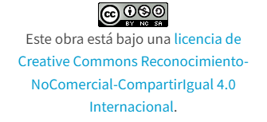

# Microbit
## Contenido
- [Introduccion](introduccion.md)
- [Modulo1: La placa Microbit y sus elementos](modulo1.md)
- [Módulo2: Programación básica  1](modulo2.md)
- [Módulo3: Programación básica  2](modulo3.md)
- [Módulo4: Ampliación](modulo4.md)
- [Módulo5: Videos](modulo5.md)

## Referencias
- [Make Code](https://makecode.microbit.org/)

## Autores
- Daniel Tenorio Ferrera
- Hugo Gonzalez Salas
## Licencia

