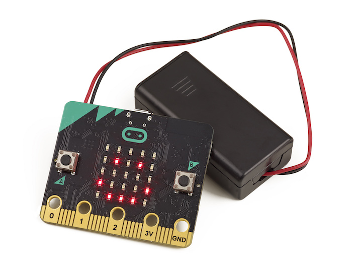

## ¿Qué es STEAM? 
 El término STEAM surge de las siglas en inglés de:  Science, Technology, Engineering, Arts & Mathematics.
 ## ¿Qué es una placa Microbit?
 Es una placa programable, es decir, una placa con un procesador y otros componentes que la convierte en una pequeña computadora cuyo comportamiento podemos programar.
 
 
