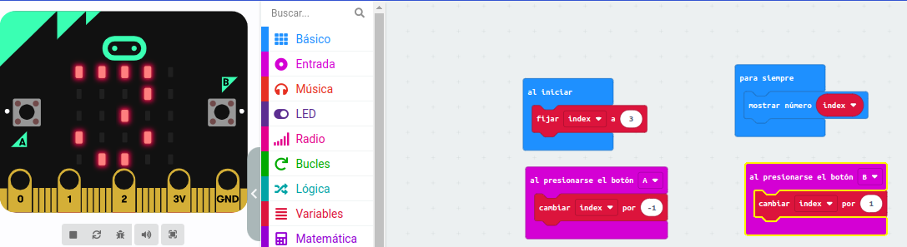
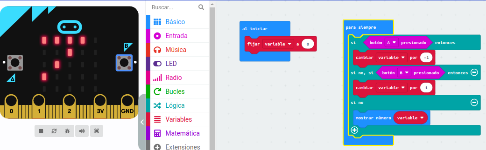

# La placa Microbit y sus elementos
## Actividad 1
A continuación, detallamos los pasos a seguir para que la placa muestre una cara
feliz al pulsar el botón A, y un corazón al pulsar el botón B.
Para completar la actividad seguimos el esquema de bloques con el que
programamos el botón A, esta vez haciendo que al presionarse el botón B se
muestre una cara triste, con lo que el programa quedaría como se muestra a
continuación:
Al presionarse el botón A
mostrar LEDs (cara feliz)

Al presionarse el botón B
mostrar LEDs (corazón)

## Solución

## Actividad 2
A continuación, detallamos los pasos a seguir para utilizar el sensor de
temperatura para mostrar sus valores en la pantalla al presionar los botones A y B.
Para completar la actividad seguimos el esquema de bloques con el que
programamos el botón A:
Al presionarse el botón A
mostrar número (temperatura (ºC))

