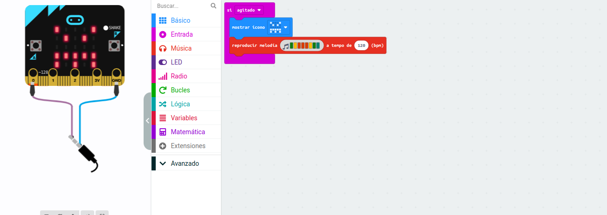
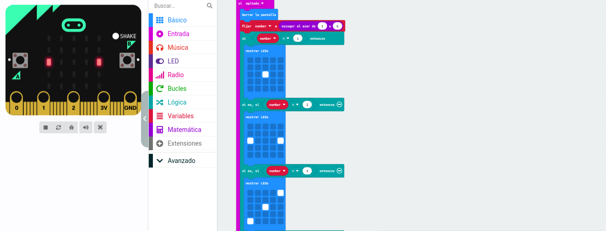
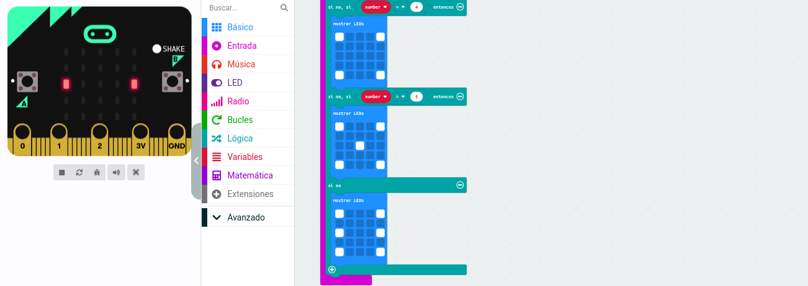

#  Ampliación
## Alarma
- ¿Qué es?

Crea una alarma que se encienda y haga sonar una melodía cuando tu micro:bit se mueva

- Cómo funciona

En este proyecto crearás una alarma que se apague cuando muevas tu micro:bit Puedes esconderlo dentro o colocarlo encima de algo valioso, o ponerlo en un bolso y utilizarlo como recordatorio para comprobar que tienes todo lo que necesitas cuando salgas.

Tu micro:bit contiene un acelerómetro que mide fuerzas. El acelerómetro detecta un gesto de agitación y muestra un patrón en la pantalla LED.

También reproduce una melodía de advertencia. Para escuchar la melodía, utiliza el simulador de MakeCode o conecta unos auriculares al pin 0 y a GND. También puedes utilizar un altavoz amplificado.

Pulsa el botón de restablecer de la parte trasera de tu micro:bit para borrar la pantalla y dejarla lista para ser utilizada de nuevo.

- [Enlace](alarma.hex)

## Dados
- ¿Qué es?

Un proyecto con dados que usa el patrón de puntitos de un dado en lugar de números.

- Cómo funciona

Como el proyecto de Dados, este proyecto usa el acelerómetro detectar cuándo es agitado, iniciar la creación de un número aleatorio entre 1 y 6 y mostrarlo en la pantalla LED.

En lugar de mostrar el número, este programa usa selección para mostrar puntos en la pantalla que, igual que los dados de verdad, representan el número que ha sido generado.
 

- [Enlace](alarma.hex)
